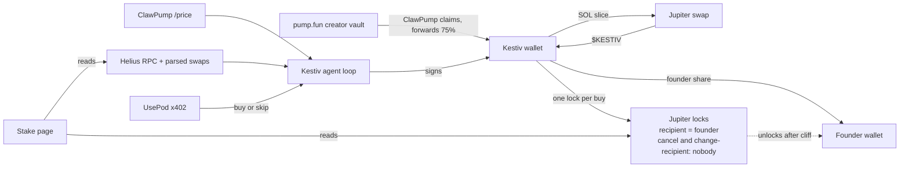

# Kestiv - Architecture

## Overview



One process, one wallet, one Jupiter lock per buy. No custom program.

## Components

| Component | Tech | Responsibility |
|---|---|---|
| `agent/` | TypeScript, Node 22 | CLI (`init`, `status`, `run-once`, `loop`), loop state machine, limits, signing |
| `agent/chain/` | `@solana/web3.js`, Helius | Balances, holders, parsed swaps, tx send and confirm |
| `agent/swap/` | Jupiter Swap API | Quote and swap tx for SOL to $KESTIV. Fallback: `@pump-fun/pump-sdk` |
| `agent/lock/` | Jupiter Lock program (`create_vesting_escrow_v2`), built natively | Create one lock per buy, read and verify locks |
| `agent/usepod/` | fetch + x402 SOL rail | Organic-trading verdict |
| `agent/clawpump/` | ClawPump partner API | `/price` market data. Launch helper (used once) |
| `agent/store/` | SQLite (`better-sqlite3`) | Inflows, slices, loop runs, idempotency |
| `web/` | Next.js 16, Tailwind v4 | Stake page. Server-side chain reads. Reads agent status from the agent's read-only `/status` |
| `skill/kestiv/` | Hermes SKILL.md + scripts | Wraps the CLI for Hermes agents (claw-agent) |

## Key decisions (frozen)

| ID | Decision | Why | Cost of changing later |
|---|---|---|---|
| ADR-1 | Kestiv's keypair is generated before $KESTIV launches and passed as ClawPump `payoutWallet` | Fees land directly in the agent. ClawPump fixes the payout wallet once the token exists | Impossible to change after launch. Lose this key and future fees are lost |
| ADR-2 | Buys go through Jupiter from Kestiv's own wallet | ClawPump `/swap/execute` rejects wallets that aren't a ClawPump agent wallet (403) | Rewriting the buy path |
| ADR-3 | One Jupiter lock per buy | Jupiter Lock has no top-up and no protocol fee, and a lock costs about 0.004 to 0.005 SOL. Stake and cap are the sum over all locks | More accounts to read, and a fixed cost per slice |
| ADR-4 | Lock modes: cancel mode 0 and update-recipient mode 0 (nobody), no lump at the cliff, 90 day cliff, 365 daily periods | The modes are fixed when a lock is created, so nobody can switch them on later. Checked on devnet: a cancel attempt fails with error 6005 | The whole trust claim |
| ADR-5 | Vesting: start = cliff = creation + 90 days, daily period, amountPerPeriod = floor(slice / 365), cliffAmount 0. Every lock has its own schedule, so each slice unlocks at the same pace. The first unlock comes one period after the cliff. A remainder under 365 raw units stays in the wallet | Long enough that "delayed dump" doesn't apply during judging or soon after | Terms visible onchain. Terms cannot be changed after creation |
| ADR-6 | Lock-first: every loop locks any unlocked $KESTIV before anything else | Closes the gap between buy and lock | Tokens could sit unlocked |
| ADR-7 | Slice IDs are written to SQLite before sending and marked done only after confirmation | No double buys on retry | Duplicate spending |
| ADR-8 | Hard rules decide size. UsePod can only veto | Money never depends on a model | UsePod becomes decoration, or a model controls funds |
| ADR-9 | Signing guard: before signing, decode the message and assert top-level program IDs are in an allowlist | A compromised API response can't make Kestiv sign something else | Wider attack surface |
| ADR-10 | The stake page reads the locks and mint supply from chain. It takes lock addresses from the agent's report, then checks each one on chain (creator, recipient, mint). Agent status is labelled agent-reported | UI never disagrees with the chain | Trust loss on one bad frame |
| ADR-11 | No sell code path exists | Nothing to exploit, nothing to explain | None |

Signing allowlist (top-level instructions): System, Compute Budget, SPL Token, Associated Token Account, Jupiter v6 aggregator, pump.fun program, PumpSwap AMM (fallback path), Jupiter Lock (create only). Exact program IDs are pinned in `agent/chain/allowlist.ts` and verified against a live transaction on day 1.

## Loop state machine

```
IDLE
 └─ run-once
     1. LOCK_PENDING   any unlocked $KESTIV in wallet? -> create a new lock -> confirm
     2. INTAKE         new SOL inflows since last run? -> tag fee|seed -> forward founder share -> confirm
     3. GATES          cap reached? cooldown? budget >= min slice? -> else WAIT(reason)
     4. SIGNALS        ClawPump /price (volume24h, liquidity, marketCap), Helius holders, 6h VWAP
                       -> any trigger fails -> WAIT(reason)
     5. SIZE           slice = min(budget, 1% liquidity, cap headroom in SOL) -> < min slice -> WAIT(reason)
     6. QUOTE          Jupiter quote -> impact > 1.5% or spot > 1.3x VWAP -> SKIP(reason)
     7. VETO           UsePod verdict on last 200 swaps -> skip -> SKIP(reason). Error -> SKIP(usepod_unavailable)
     8. BUY            slice row inserted (pending) -> sign (allowlist) -> send -> confirm -> row done
     9. LOCK           create a new lock -> confirm -> row locked
 └─ write status.json, sleep random 30-90 min (loop mode)
```

Every exit writes one status line: `{state, reason, txs[], ts}`.

## Data model (SQLite)

```sql
inflows(sig TEXT PRIMARY KEY, lamports INTEGER, source TEXT CHECK(source IN ('fee','seed')), ts INTEGER)
forwards(sig TEXT PRIMARY KEY, inflow_sig TEXT, lamports INTEGER, ts INTEGER)
slices(id TEXT PRIMARY KEY, status TEXT CHECK(status IN ('pending','bought','locked','failed')),
       sol_in INTEGER, tokens_out TEXT, buy_sig TEXT, lock_sig TEXT, reason TEXT, created_ts INTEGER)
locks(escrow TEXT PRIMARY KEY, sig TEXT, amount TEXT, ts INTEGER)  -- one row per Jupiter lock
runs(id INTEGER PRIMARY KEY, state TEXT, reason TEXT, ts INTEGER)
config(key TEXT PRIMARY KEY, value TEXT)  -- mint, founder, vesting_terms; write-once keys enforced in code
```

Inflow tagging: transfers from ClawPump's fee forwarder address are `fee`. Everything else is `seed`. The forwarder address is recorded from the first observed payout and pinned in config.

## External interfaces

| Interface | Call | Notes |
|---|---|---|
| ClawPump | `GET https://clawpump.tech/api/v1/price?mint=` | Use the apex domain. `agents.clawpump.tech` redirects and drops the auth header |
| ClawPump | `POST /api/v1/launch` with `payoutWallet` | Once. Check the response `payoutWallet` equals Kestiv's address |
| Jupiter | quote, then swap | Verify access and curve routing on day 1 (PRD A2, A3) |
| Jupiter Lock | `create_vesting_escrow_v2`, then reading escrow accounts | No SDK in the agent. The instruction is built natively and matches the reference client byte for byte (`agent/test/jupiter-lock.test.ts`) |
| UsePod | `POST https://api.usepod.ai/proxy/x402/v1/chat/completions` | 402 quote, pay SOL rail, retry identical body with `PAYMENT-SIGNATURE`. Body must be byte-identical |
| Helius | RPC, token accounts by mint, parsed tx history | Key in env, server-side only |

UsePod prompt contract: input is a compact table of the last 200 swaps (time, side, SOL size, wallet hash). Output must parse as `{"verdict":"buy"|"skip","reason":string}` with `max_tokens` 120. Anything else counts as skip.

## Configuration (`.env`)

| Var | Purpose |
|---|---|
| `KESTIV_KEYPAIR_PATH` | Path to Kestiv's keypair, outside the repo, mode 600 |
| `FOUNDER_WALLET` | Vesting recipient and founder share destination |
| `KESTIV_MINT` | Token mint |
| `CLAWPUMP_API_KEY` | Partner API |
| `HELIUS_API_KEY` | RPC and indexing |
| `JUPITER_API_KEY` | Optional, if the API requires it |
| `USEPOD_MODEL` | Model for the veto, default a cheap open model |
| `STATUS_PORT` | Read-only status endpoint for the web page |

## Trust model (stated in the README)

- Kestiv holds a hot key. It only ever holds unforwarded fee SOL and tokens between buy and lock. The key cannot move locked tokens.
- Buy and lock are two transactions. The lock-first rule closes the gap on the next run.
- The founder can stop the agent. The founder cannot cancel or redirect the locked stake.
- Inflows are tagged fee or seed so "funded by fees" is checkable.

## Failure handling

| Failure | Behaviour |
|---|---|
| RPC or API timeout | Skip this run with a reason. No partial state beyond `pending` slice rows |
| Buy sent, confirmation unknown | Re-check signature status before any new buy. Never resend a pending slice ID |
| Lock fails after buy | Row stays `bought`. Next run's step 1 locks it |
| UsePod error or bad JSON | Skip with `usepod_unavailable` |
| Cap reached | State `CAP_REACHED`. Forward all fees to founder |
